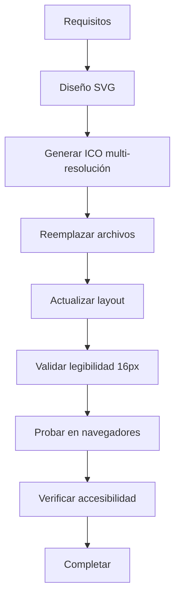

# Plan de Implementación: Favicon DC

## Análisis Actual
- **Proyecto**: Sitio web personal con Astro + Tailwind CSS
- **Favicon actual**: SVG con diseño de smiley y letra "A" en fondo azul
- **Ubicación archivos**: `public/favicon.svg` y `public/favicon.ico`
- **Referencia en layout**: `src/layouts/BaseLayout.astro` línea 11

## Requisitos Específicos
1. **Iniciales**: "DC" en mayúsculas
2. **Estilo tipográfico**: Fuente monospace
3. **Colores**: 
   - Fondo oscuro sólido (#1f2937 - gray-800 de Tailwind)
   - Texto blanco (#ffffff)
4. **Diseño**: Minimalista, sin elementos decorativos
5. **Legibilidad**: Debe ser legible en 16×16px (tamaño mínimo de favicon)

## Especificaciones Técnicas

### 1. Favicon SVG (`public/favicon.svg`)
```svg
<svg xmlns="http://www.w3.org/2000/svg" viewBox="0 0 100 100">
  <rect width="100" height="100" fill="#1f2937"/>
  <text 
    x="50" 
    y="65" 
    text-anchor="middle" 
    fill="#ffffff" 
    font-family="'Courier New', Courier, monospace"
    font-size="60" 
    font-weight="bold"
    letter-spacing="2"
  >DC</text>
</svg>
```

**Características**:
- ViewBox 100×100 para alta resolución
- Texto centrado vertical y horizontalmente
- Letter-spacing para mejor separación en tamaños pequeños
- Fuente monospace con fallback a fuentes comunes

### 2. Favicon ICO (`public/favicon.ico`)
- Formato ICO con múltiples resoluciones: 16×16, 32×32, 48×48, 64×64
- Generado desde el SVG usando herramienta de conversión
- Mantener transparencia para compatibilidad

### 3. Actualización del Layout
Modificar `src/layouts/BaseLayout.astro`:
- Mantener referencia a `/favicon.svg` para navegadores modernos
- Agregar referencia a `/favicon.ico` para compatibilidad legacy

## Plan de Implementación

### Fase 1: Diseño y Creación
1. **Crear nuevo SVG** con las especificaciones
2. **Generar ICO** desde el SVG usando:
   ```bash
   # Usar herramienta como ImageMagick o convertidor online
   convert favicon.svg -resize 16x16 favicon-16.png
   convert favicon.svg -resize 32x32 favicon-32.png
   # Combinar en ICO
   ```

### Fase 2: Integración
1. **Reemplazar archivos existentes** en `public/`
2. **Actualizar layout** para referencias correctas
3. **Agregar meta tags** adicionales para mejor soporte:
   ```html
   <link rel="icon" type="image/svg+xml" href="/favicon.svg" />
   <link rel="icon" type="image/x-icon" href="/favicon.ico" />
   <link rel="shortcut icon" href="/favicon.ico" />
   ```

### Fase 3: Validación
1. **Verificar legibilidad** en 16×16px
2. **Probar en navegadores**: Chrome, Firefox, Safari, Edge
3. **Probar en dispositivos**: iOS, Android, escritorio
4. **Verificar en diferentes contextos**:
   - Pestañas del navegador
   - Marcadores/favoritos
   - Pantalla de inicio (mobile)

## Consideraciones de Accesibilidad
- Contraste suficiente (texto blanco sobre fondo #1f2937 = ratio ~12:1)
- Sin dependencia de color para significado
- Diseño simple que escala bien

## Diagrama de Flujo



## Riesgos y Mitigación
- **Riesgo**: Texto ilegible en 16×16px
  - **Mitigación**: Probar con zoom y ajustar tamaño de fuente
- **Riesgo**: Incompatibilidad con navegadores antiguos
  - **Mitigación**: Proveer formato ICO como fallback
- **Riesgo**: Pérdida de calidad en conversión SVG→ICO
  - **Mitigación**: Usar herramientas profesionales y validar resultado

## Criterios de Aceptación
- [ ] Favicon muestra "DC" claramente en 16×16px
- [ ] Colores: fondo #1f2937, texto blanco
- [ ] Fuente monospace reconocible
- [ ] Compatible con todos los navegadores principales
- [ ] Sin elementos decorativos adicionales
- [ ] Archivos correctamente ubicados en `public/`
- [ ] Layout actualizado con referencias apropiadas

## Archivos a Modificar/Crear
1. `public/favicon.svg` (reemplazar)
2. `public/favicon.ico` (reemplazar)
3. `src/layouts/BaseLayout.astro` (modificar línea 11 y agregar meta tags)
4. `plans/favicon-dc-plan.md` (este archivo)

## Herramientas Recomendadas
- **SVG editor**: Cualquier editor de texto o VS Code
- **ICO generator**: ImageMagick, convertio.co, o icoconvert.com
- **Validación**: Lighthouse, favicon checker online